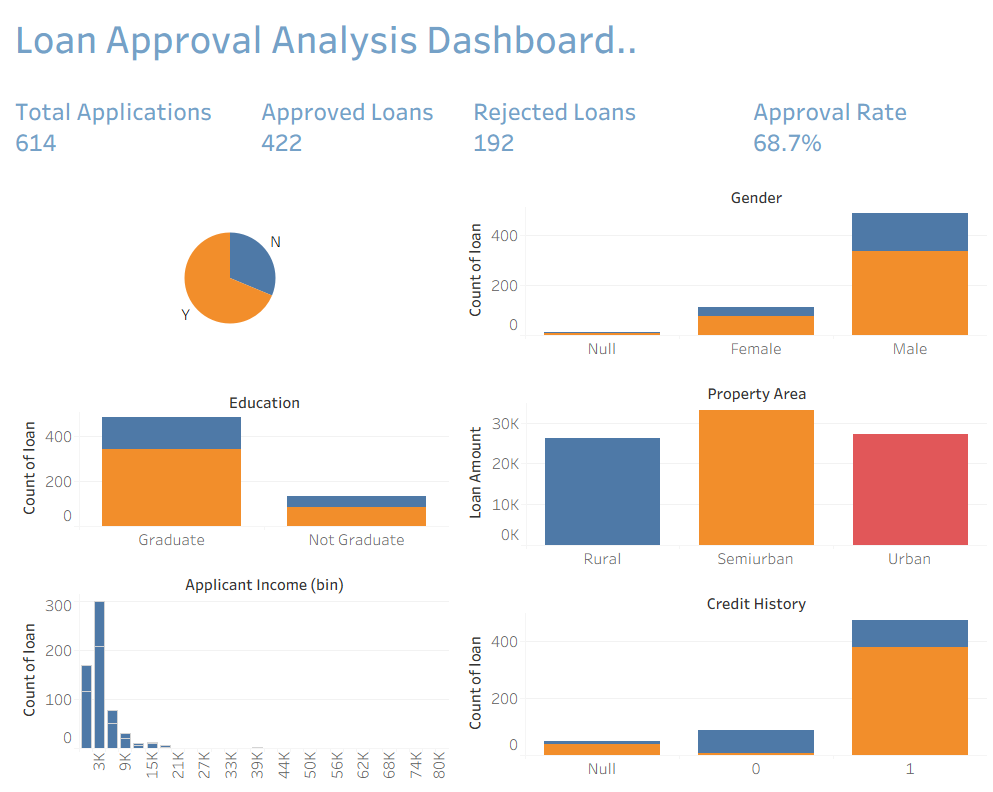

# 📊 Business Sales Performance Analytics

## 📌 Future Interns – Data Science & Analytics Internship

**Task:** Task 1 – Business Sales Performance Analytics

**Repository:** FUTURE_DS_01

---

# 📖 Project Overview

This project analyzes an E-Commerce sales dataset to identify business performance, revenue trends, top-selling products, customer activity, and regional sales performance.

The objective is to transform raw business data into meaningful insights through an interactive Tableau dashboard that supports data-driven business decisions.

---

# 🎯 Objectives

- Analyze business sales performance
- Identify revenue trends over time
- Discover top-selling products
- Analyze regional sales performance
- Calculate important business KPIs
- Generate actionable business recommendations

---

# 🛠 Tools Used

- Tableau
- Microsoft Excel

---

# 📂 Dataset

**Dataset:** Online Retail Dataset

The dataset contains information about:

- Invoice Number
- Product Description
- Quantity
- Unit Price
- Invoice Date
- Customer ID
- Country

---

# 📈 Dashboard Features

The dashboard contains the following business KPIs:

- 💰 Total Revenue
- 📦 Total Orders
- 👥 Total Customers
- 🛒 Total Quantity Sold

Visualizations included:

- Monthly Revenue Trend
- Top 10 Products by Revenue
- Revenue by Country
- Top Products by Quantity Sold

---

# 📊 Key Performance Indicators (KPIs)

| KPI | Description |
|------|-------------|
| Total Revenue | Total revenue generated from all sales |
| Total Orders | Total unique customer orders |
| Total Customers | Total unique customers |
| Total Quantity Sold | Total number of products sold |

---

# 💡 Business Insights

### 1. Strong Overall Revenue Performance

The business generated significant revenue during the analysis period, indicating healthy sales performance.

---

### 2. Top Products Drive Revenue

A small number of products contribute a large portion of total revenue, showing that best-selling products play a major role in business success.

---

### 3. Regional Performance Varies

Revenue differs across countries, with some regions contributing significantly more revenue than others. This indicates opportunities for region-specific business strategies.

---

### 4. Seasonal Sales Trends

Monthly revenue analysis shows fluctuations throughout the year, indicating seasonal customer purchasing behavior.

---

### 5. Customer Purchase Activity

The business has a substantial customer base with repeated purchasing behavior, suggesting opportunities to improve customer retention through loyalty programs.

---

# 🚀 Business Recommendations

### ✅ Focus on Best-Selling Products

Increase inventory and marketing investment for high-performing products to maximize revenue.

---

### ✅ Expand High-Revenue Regions

Increase advertising and promotional campaigns in countries generating the highest revenue.

---

### ✅ Improve Low-Performing Markets

Analyze low-performing regions and introduce targeted marketing campaigns to improve sales.

---

### ✅ Prepare for Seasonal Demand

Use historical monthly sales trends to improve inventory planning before peak sales periods.

---

### ✅ Strengthen Customer Retention

Introduce loyalty rewards, personalized offers, and email campaigns to encourage repeat purchases.

---

# 📷 Dashboard Preview

> Add your dashboard screenshot here.

Example:

```
dashboard.png
```

After uploading the image to GitHub:

```markdown

```

---

# 📁 Project Structure

```
FUTURE_DS_01
│
├── README.md
├── Business_Sales_Analytics.twbx
├── dashboard.png
├── OnlineRetail.xlsx
```

---

# 🎓 Skills Demonstrated

- Data Cleaning
- Business Analytics
- KPI Analysis
- Dashboard Development
- Data Visualization
- Business Intelligence
- Tableau
- Insight Generation
- Business Storytelling

---

# 📌 Conclusion

This project demonstrates how business sales data can be transformed into actionable insights using Tableau. The dashboard provides an interactive overview of business performance, enabling stakeholders to monitor revenue trends, identify high-performing products, evaluate regional sales, and support strategic business decisions.

---

# 👨‍💻 Author

**Shrishail Mallappa Hebballi**

Data Science & Analytics Intern

Future Interns
